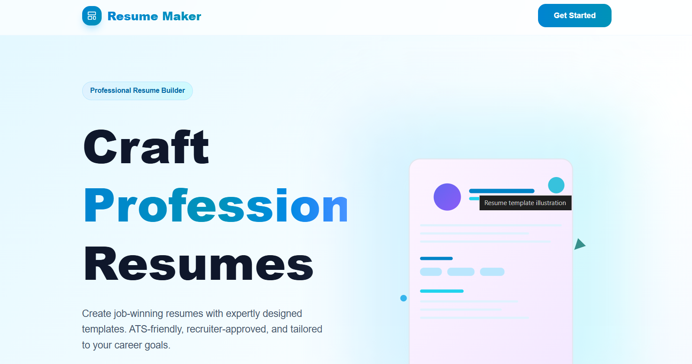
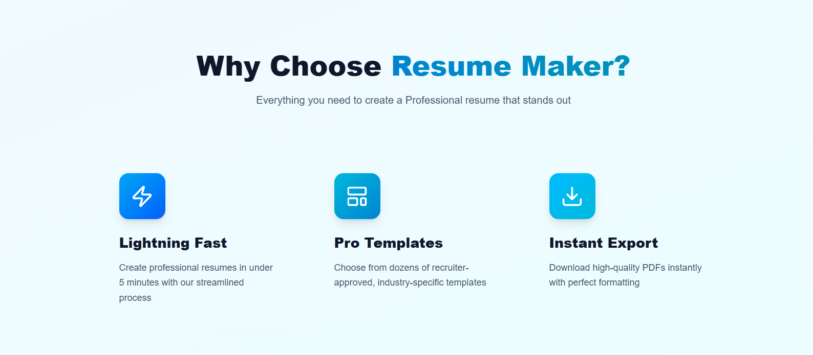
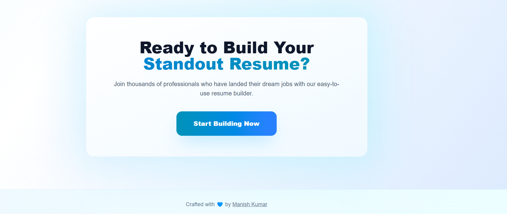
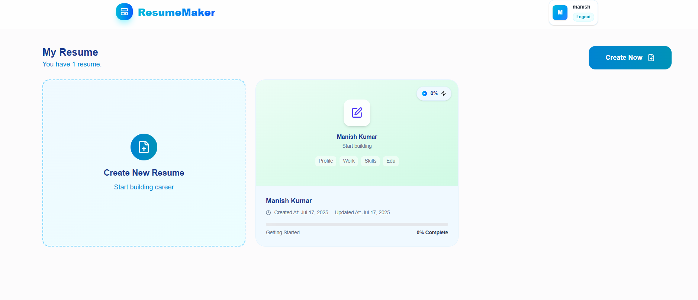
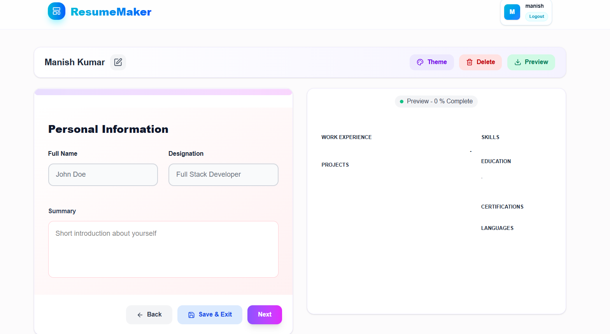

# 📄 Resume Maker - Professional Resume Builder

<div align="center">
  
  
  
  
  
</div>

<div align="center">
  <h3>🚀 Craft Professional Resumes in Minutes</h3>
  <p>Create job-winning resumes with expertly designed templates. ATS-friendly, recruiter-approved, and tailored to your career goals.</p>
</div>

---

## ✨ Features

### 🔥 **Lightning Fast**
Create professional resumes in under 5 minutes with our streamlined process

### 🎨 **Pro Templates**
Choose from dozens of recruiter-approved, industry-specific templates

### 📥 **Instant Export**
Download high-quality PDFs instantly with perfect formatting

### 🔐 **Secure Authentication**
JWT-based authentication system with password encryption

### 🖼️ **Image Management**
Upload profile pictures and generate resume thumbnails

### 📱 **Responsive Design**
Works seamlessly across desktop, tablet, and mobile devices

---

## 🖥️ Application Screenshots

### 🏠 Landing Page
*Beautiful, modern landing page with compelling call-to-action*

<div align="center">
  
</div>

<div align="center">
  
</div>

<div align="center">
  
</div>

### 📊 Dashboard
*Clean dashboard showing user's resumes with completion tracking*

<div align="center">
  
</div>

### ✏️ Resume Editor
*Intuitive step-by-step resume builder with live preview*

<div align="center">
  
</div>

---

## 🛠️ Tech Stack

### Frontend
- **React 18+** - Modern UI library with hooks
- **Vite** - Fast build tool and development server
- **Tailwind CSS** - Utility-first CSS framework
- **Lucide React** - Beautiful icon library
- **React Router** - Client-side routing
- **Axios** - HTTP client for API calls
- **html2pdf.js** - PDF generation
- **html2canvas** - Canvas-based image generation

### Backend
- **Node.js** - JavaScript runtime
- **Express.js** - Web application framework
- **MongoDB** - NoSQL database
- **Mongoose** - MongoDB object modeling
- **JWT** - JSON Web Tokens for authentication
- **bcrypt** - Password hashing
- **Multer** - File upload middleware
- **CORS** - Cross-origin resource sharing

---

## 📁 Project Structure

```
RESUME_MAKING/
├── 📂 frontend/                 # React frontend application
│   ├── 📂 src/
│   │   ├── 📂 components/       # Reusable UI components
│   │   │   ├── Cards.jsx        # Resume and profile cards
│   │   │   ├── CreateResumeForm.jsx
│   │   │   ├── DashboardLayout.jsx
│   │   │   ├── EditResume.jsx   # Main resume editor
│   │   │   ├── Forms.jsx        # Form components library
│   │   │   ├── Input.jsx        # Input components
│   │   │   ├── Modal.jsx        # Modal dialog component
│   │   │   ├── Navbar.jsx       # Navigation component
│   │   │   └── ...
│   │   ├── 📂 context/          # React context providers
│   │   ├── 📂 pages/            # Page components
│   │   ├── 📂 utils/            # Utility functions
│   │   └── 📂 assets/           # Static assets
│   ├── package.json
│   └── vite.config.js
├── 📂 backend/                  # Node.js backend API
│   ├── 📂 config/               # Configuration files
│   │   └── db.js               # Database connection
│   ├── 📂 controllers/          # API controllers
│   │   ├── resumeController.js  # Resume CRUD operations
│   │   ├── userController.js    # User authentication
│   │   └── uploadImages.js      # Image upload handling
│   ├── 📂 middleware/           # Custom middleware
│   │   ├── authMiddleware.js    # JWT authentication
│   │   └── uploadMiddleware.js  # File upload configuration
│   ├── 📂 models/               # Database models
│   │   ├── resumeModel.js       # Resume schema
│   │   └── userModel.js         # User schema
│   ├── 📂 routes/               # API routes
│   │   ├── resumeRoutes.js      # Resume endpoints
│   │   └── userRoutes.js        # Authentication endpoints
│   ├── 📂 uploads/              # Uploaded files storage
│   ├── package.json
│   └── server.js               # Express server configuration
└── README.md
```

---

## 🚀 Getting Started

### Prerequisites
- **Node.js** (v18.0 or higher)
- **MongoDB** (v6.0 or higher)
- **npm** or **yarn**

### Installation

1. **Clone the repository**
```bash
git clone https://github.com/kumarmanish562/RESUME_MAKING.git
cd RESUME_MAKING
```

2. **Setup Backend**
```bash
cd backend
npm install

# Create .env file
cp .env.example .env
# Add your MongoDB URI and JWT secret
```

3. **Setup Frontend**
```bash
cd frontend
npm install
```

4. **Environment Variables**

Create a `.env` file in the backend directory:
```env
MONGO_URI=mongodb://localhost:27017/resumemaker
JWT_SECRET=your_super_secret_jwt_key
PORT=5000
```

5. **Start the Application**

Backend (Terminal 1):
```bash
cd backend
npm run dev
```

Frontend (Terminal 2):
```bash
cd frontend
npm run dev
```

6. **Access the Application**
- Frontend: `http://localhost:5173`
- Backend API: `http://localhost:5000`

---

## 🔧 API Endpoints

### Authentication
- `POST /api/auth/register` - User registration
- `POST /api/auth/login` - User login
- `GET /api/auth/profile` - Get user profile (Protected)

### Resume Management
- `POST /api/resume` - Create new resume (Protected)
- `GET /api/resume` - Get user's resumes (Protected)
- `GET /api/resume/:id` - Get specific resume (Protected)
- `PUT /api/resume/:id` - Update resume (Protected)
- `PUT /api/resume/:id/upload-image` - Upload resume images (Protected)
- `DELETE /api/resume/:id` - Delete resume (Protected)

---

## 🎯 Key Features Implementation

### Multi-Step Resume Builder
- **Step Progress Tracking** - Visual progress indicator
- **Form Validation** - Real-time validation with error messages
- **Auto-Save** - Automatic saving of resume progress
- **Live Preview** - Real-time resume preview while editing

### Template System
- **Theme Selection** - Multiple professional templates
- **Color Customization** - Customizable color palettes
- **Responsive Templates** - Mobile-friendly resume layouts

### PDF Generation
- **High-Quality Export** - Professional PDF output
- **A4 Format** - Standard resume format compliance
- **Print Optimization** - Optimized for printing

### Image Management
- **Profile Pictures** - Upload and manage profile photos
- **Thumbnail Generation** - Automatic resume thumbnails
- **File Validation** - Secure file type validation

---

## 🤝 Contributing

1. Fork the project
2. Create your feature branch (`git checkout -b feature/AmazingFeature`)
3. Commit your changes (`git commit -m 'Add some AmazingFeature'`)
4. Push to the branch (`git push origin feature/AmazingFeature`)
5. Open a Pull Request

---


## 👨‍💻 Author

**Manish Kumar**
- GitHub: [@kumarmanish562](https://github.com/kumarmanish562)
- LinkedIn: [Manish Kumar](https://linkedin.com/in/manish-kumar)

---

## 🙏 Acknowledgments

- **React Team** - For the amazing React library
- **Express.js** - For the robust web framework
- **MongoDB** - For the flexible database solution
- **Tailwind CSS** - For the beautiful styling system
- **Lucide** - For the beautiful icons

---

<div align="center">
  <h3>⭐ Star this repository if you found it helpful!</h3>
  <p>Made with ❤️ by <strong>Manish Kumar</strong></p>
</div>

---

## 🔮 Future Enhancements

- [ ] Multiple resume templates
- [ ] ATS score analysis
- [ ] Resume sharing functionality
- [ ] Collaborative editing
- [ ] Resume analytics
- [ ] Integration with job boards
- [ ] AI-powered content suggestions
- [ ] Multi-language support

---

*Ready to build your standout resume? Join thousands of professionals who have landed their dream jobs with our easy-to-use resume builder.*
